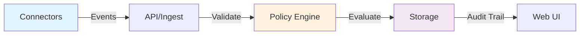

# Diagrams

Visual assets for Kanshi documentation.

## Directory Structure

```
diagrams/
  *.md           – Markdown files with embedded diagrams
  *.svg          – Exported SVG diagrams (source of truth: Miro, Excalidraw, etc.)
  *.png          – PNGs for quick viewing (optional; SVGs preferred)
  README.md      – This file
```

## Naming Conventions

- **Source files:** `<component>-<version>.source` (e.g., `event-flow-v1.source`)
- **Exports:** `<component>-<version>.<ext>` (e.g., `event-flow-v1.svg`, `event-flow-v1.png`)
- **Markdown embeds:** Reference SVG or link to source tool

### Versioning
Increment version if diagram changes materially (logic, not just styling):
- `event-flow-v1.svg` → `event-flow-v2.svg` (new component added)
- Update links in docs when version changes

## Creating & Editing Diagrams

### Tools We Use
1. **Miro** (high-level architecture)
   - Export as SVG + PNG
   - Share link in ADR or issue
   - Keep board in shared workspace

2. **Excalidraw** (flowcharts, quick sketches)
   - Export as JSON (source) + SVG (view)
   - Store both in repo

3. **Mermaid.js** (inline in Markdown)
   - For simple, text-based diagrams
   - Embed directly in `.md` files
   - No external files needed

4. **SVG by hand** (if simple)
   - Edit in VS Code or Illustrator
   - Include as-is

### Process
1. Draft diagram in tool of choice
2. Review with team (async or sync)
3. Export to SVG (or embed Mermaid code in `.md`)
4. Commit both source + export to repo
5. Link from main docs with inline or `` markdown

## Embedded Example

### Event Flow (Mermaid)



### Component Architecture (SVG)

See [event-flow-v1.svg](event-flow-v1.svg) for the full system diagram.

## Diagram Checklist

Before committing a diagram:
- [ ] Title / caption explains purpose
- [ ] Color scheme is accessible (test with colorblind simulator)
- [ ] Labels are clear and use consistent terminology
- [ ] Source and export are both in repo (if tool exports)
- [ ] Linked from relevant `.md` doc
- [ ] Version number incremented if material change

## Contributing

**New diagram?**
1. Create / draft in tool
2. Export as SVG
3. Add to this directory with version
4. Link from relevant doc
5. Create a PR

**Update existing diagram?**
- Check prior version comments/issues
- Increment version number
- Update all links in docs

## Questions?

Refer to [../docs/architecture.md](../docs/architecture.md) for the main system diagram explanation.
